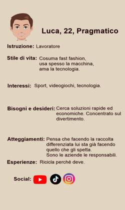
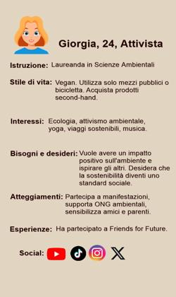
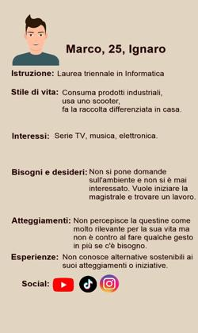
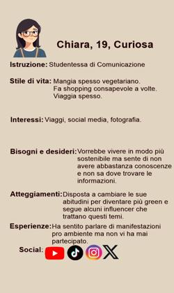

# Progetto d'esame: GuidaGreen

## Introduzione

Il progetto gestisce la creazione di un prodotto editoriale digitale per un ente no-profit che promuove la sostenibilità ambientale. L'obiettivo del progetto era avvicinare giovani (18-25 anni) ai temi del cambiamento climatico e dell'impatto ambientale che hanno le loro scelte quotidiane. Il tutto doveva essere svolto tramite piattaforme social. 

La strada che si è intrapresa è stata quella della creazione di un **video** di circa 3 minuti, semplice e mirato, da postare su piattaforme social come TikTok e YouTube Shorts in modo da attirare l'attenzione dei giovani sull'ente e l'argomento. 

Il video tratta di un piccolo argomento toccato dal prodotto completo che però è una tematica attuale in grado di far sentire coinvolti e attirare l'attenzione: l'inquinamento digitale.

Nella didascalia del video, postato dalla pagina social dell'ente, si potrà poi risalire al prodotto completo: la GuidaGreen.

Essa è un **webbook** che funge da guida online, la quale, attraverso un contenuto semplice e coinvolgente mira ad essere una vera e propria guida semplice per i giovani che voglio approcciarsi al tema della sostenibilità. 

L'obiettivo era raccogliere in un unico posto conoscenze base, dati statistici, opinioni di esperti e consigli di stile di vita riguardo le tematiche green, in modo da facilitare il reperimento di informazioni sparse per il Web riguardo l'argomento.

Per renderlo il più facilmente aggiornabile e fruibile è stato utilizzato MkDocs per la creazione del webbook e, in parte, script Python e sotfware IA per il video.

## Ideazione 

### Tema

I temi principali affrontati dai prodotti editoriali generati sono stati:

+ Cambiamento climatico
+ Impatto ambientale
+ Scelte di vita Green
+ Dati di inquinamento
+ Inquinamento digitale 

Attraverso ricerche, si è riscontrato che il target a cui è rivolto il prodotto è già largamente consapevole dell'esistenza delle tematiche ambientali e molti sono già attivi in tal senso.

Moltissimi giovani cercano informazioni su questi temi e molti sono fortemente attivi sui social riguardo questi aromenti. 

Spesso però, l'enormità di fonti disponibili crea confusione e demoralizza i neofiti del tema. A volte il problema è anche che non si è nemmeno sicuri che le fonti che si stanno usando siano attendibili. 

Sono stati identificati due filoni principali di domande:
 
+ Cos'è il green, il cambiamento climatico e la sostenibilità
+ Svariate domande su cosa sia green e cosa non lo sia

Da qui l'idea di creare una guida digitale che potesse:

+ Dare informazioni basilari sul cambiamento climatico e impatto ambientale 
+ Dare suggerimenti base per azioni quotidiane più green
+ Parlare di una tematica più specifica come l'inquinamento digitale
+ Offrire link a paper scritti da esperti del settore su questi argomenti 
+ Offrire grafici e dati statistici visivamente chiari e offerti da fonti sicure (EEA)
+ Offrire uno spazio in cui alcune fonti ambigue sono chiarite da esperti
+ Offrire opportunità coinvolgenti come test e challenge
+ Spingere gli utenti stessi a contrinuire (magari sulla repo github del webbook resa pubblica o con dei commenti sotto il video che possono poi essere integrati).

Per il video si è pensato invece di andare a concentrarsi su un piccolo settore: quello dell'inquinamento digitale. La brevità del video non permetteva di trattare tutti i temi che vengono trattati nel webbook.
Quindi si è optato per il digitale essendo un tema attuale e sul quale ancora c'è parecchia confusione, ormai la tecnologia fa parte della nostra vita quotidiana e soprattutto di quella dei giovani, ed è corretto imparare ad utilizzarla in modo consapevole. 

### Destinatari

Sono state pensate quattro personas che potessero rappresentare al meglio il target prefissato. 
Il campione è piccolo ma il più rappresentativo possibile sulle varie tipologie di approccio alla tematica.

Dopo aver fatto ricerche sul grado di interesse per le tematiche ambientali sui giovani di questa fascia e le loro attività sui social sono stati raccolti questi risultati: 

+ È raro, nell'anno corrente, che persone tra i 18 e 25 anni non abbiano mai sentito parlare di sostenibilità e delle problematiche ambientali, quindi sono state create delle personas che fossero plausibili con questo contesto sociale. Tutte loro dimostrano di conoscere la tematica anche se a profondità diverse. 
+ È ancora più raro che non utilizzino dei social comuni come TikTok, Instagram, X o YouTube. Quindi si è andati a mirare ad un prodotto che puntasse a quel tipo di piattaforme. 
+ È stato valutato anche che la maggioranza dei giovani utilizza molto più lo smartphone che il laptop o desktop, quindi un video da postare sui social era il modo più diretto per arrivare a questo tipo di destinatari.

{ width=50% }
{ width=50% }
{ width=50% }
{ width=50% }

#### Scenario 1

Luca, scorre i suoi Shorts di YouTube e vede questo video che inizia con un ragazzo che gioca online. Interessato non scorre subito al prossimo video e forse potrebbe rimanere ad ascoltare fino alla fine scoprendo qualcosa che non sapeva. Oppure potrebbe cambiare video non appena si rende conto che non si sta parlando di videogame.

#### Scenario 2

A Giorgia viene consigliato questo contenuto da un amico al quale è apparso su X cercando nell'#SostenibilitàDigitale. Giorgia si interessa subito all'argomento e volendosi informare di più esplora il webbook nel dettaglio volenterosa a partecipare al prodotto. 

#### Scenario 3
 
Marco scorrendo su TikTok vede il video e si ferma a guardarlo incuriosito dalla domanda iniziale. Inizialmente si dimentica del video. Il giorno dopo però, quando si siede davanti al Laptop per controllare le email ripensa al video e decide di ripulire almeno un po' il suo account di posta.

#### Scenario 4

Chiara, che sta cercando più informazioni su come essere più sostenibile si imbatte in questo video di TikTok e, attirata dalla domanda iniziale, scopre nuovi atteggiamenti che può adottare per essere più green. Curiosa cerca l'ente sul web o sulla loro pagina Instagram e trova un link per il webbook che la informa facilmente su questa tematica ambientale.

### Modello di fruizione

Il prodotto video è fruibile attraverso le piattaforme social TikTok, YouTube Shorts e X. Il webbook invece tramite web con URL condiviso su social.

L'esperienza di fruizione di quest'ultimo è simile a quella di un sito web.

Requisiti di accettazione:

+ **Leggibilità**: per quanto riguarda il video il contenuto è facilmente fruibile a livello di lettura visto il linguaggio semplice e la presenza di audio e sottotitoli che agevolano la comprensione. Per quanto riguarda il webbook lo stile grafico lineare e il tono informale permettono ai destinatari prefissati di comprendere il contenuto facilmente.
+ **Adattabilità**: il connubio dei due prodotti, il video è in realtà un piccolo taglio del webbook, aumentano il grado di adattabilità del prodotto permettendo all'utente di scegliere il modo con cui preferisce accedere ai contenuti. Leggere il webbook o aspettare la pubblicazione di un video successivo che riassuma altri contenuti del webbook.
+ **Accessibilità**: il video tramite sottotitoli e audio è fruibile facilmente anche da individui con inabilità. Il video è facilmente accessibile attraverso social diffusi come TikTok e YouTube e X e non richiede alcun tipo di azione se non l'ascolto o la lettura. Il webbook è facilmente raggiungibile tramite link su piattaforme social e i contenuti dello stesso sono semplicemente raggiungibili tramite dei semplici click. Entrambi i contenuti possono essere fruibili ovunque con una connessione Internet.
+ **Multimedialità**: l'unione di video e immagini del webbook garantisce un alto grado di multimedialità permettendo al fruitore di scegliere il mezzo che preferisce.  
+ **Aggiornabilità**: il video non può essere aggiornato ma se ne viene creato un altro, il fatto di seguire il profilo dell'ente, o anche solo contenuti simili, ti permetterà di visualizzare il video futuro facilmente. Il webbook invece è facilmente fruibile anche con degli aggiornamenti poichè il link a cui si fa riferimento per raggiungerlo rimane lo stesso.
+ **Interattività**: l'interazione è prevista tramite i video, i click e le challenge proposte nel webbook, che possono aumentare l'engagement del fruitore. Inoltre il coinvolgimento a condividere e aggiungere informazioni può essere coinvolgente per il destinatario e utile per l'ente che aumenta la facilità di aggiornamento e revisione del contenuto. 

Modelli di lettura privilegiati:

+ **Lettura non lineare**: i collegamenti ipertestuali sia alle altre pagine del libro che a link esterni per paper o test permettono alla guida di raccogliere facilmente in sé stessa tutto ciò che ha bisogno per essere tale. Rendendo il reperimento delle informazioni e il raggiungimento di esse molto più semplice.
+ **Lettura visuale**: uso di immagini, grafici e diagrammi aiuta il lettore a carpire direttamente il dato o l'argomento

Aspetti di innovazione:

+ Raccogliere tante informazioni in un unico luogo
+ Accesso diretto a molte informazioni con dei semplici click
+ Fonti chiare e di esperti
+ Coinvolgimento del destinatario nella condivisione di informazioni e contributo nel contenuto

### Canali di distribuzione

Canali di distribuzione che si intende raggiungere:

+ Piattaforme social: nello specifico TikTok, YouTube Shorts e X con il video
+ Web: con il webbook

Formati:

+ Webbook
+ Video MP4

Standard di formato:

|                | TikTok    | YouTube Shorts    | X         |
|----------------|-----------|-------------------|-----------|
| Lunghezza max  | 10 minuti | 3 minuti          | 10 minuti |
| Risoluzione    | 9:16      | 9:16              | --------- |
| Formati        | MP4       | MP4               | MP4       |
| Dimensioni max | 287,6 MB  | 128 GB (YT Video) | 512 MB    |
| Frame rate     | 30 fps    | 30/60 fps         | 30/60 fps |

Essendo il prodotto rivolto ai giovani la scelta del webbook punta più all'innovazione che al rispetto degli standard. 

Identità visuale:

+ **Video**: si è scelto uno stile semplice con piccoli video a scorrimento in fast cut e bande superiori e inferiori dove inserire per esempio il nome dell'ente in modo che sia facilmente identificabile, e dei sottotitoli in modo che sia facilmente fruibile anche da utenti che utilizzano la piattaforma in muto.
+ **Webbook**: l'utilizzo di emoji vicino agli elenchi di attività rende l'attività più facile da ricordare e visivamente più accattivante. 
La barra di navigazione a lato rende la pagina più organizzata e visivamente più semplice identificare i contenuti principali di essa. Il colore scuro di sfondo rispetta l'ambiente facendo lavorare meno lo schermo. Il colore di bordi e immagini invece riprende colori naturali.

Lo stile scelto è informale per rendere il contenuto più coinvolgente e accattivante. Essendo lo scopo attirare i giovani che potenzialmente non sono esperti, usare linguaggio eccessivamente tecnico o formati eccessivamente fissi e pesanti ne avrebbe sicuramente scoraggiato l'utilizzo.

## Processo di Produzione

### Acquisizione dei contenuti

Fonti utilizzate:

+ Video: 
  + Redazione manuale: parti di script del video
  + Generabili automaticamente: video generati da AI
  + Fonti libere: siti di video con licenza CC0 da poter integrare nel video, articoli UE per la creazione dello script, riarrangiati per creare un discorso in tono informale e accattivante
+ Webbook:
  + Redazione manuale: parti di testo, alcuni grafici
  + Fonti libere: Wikipedia @wikipedia_climate_change, @wikipedia_environmental_impact, articolo UE @eu_climate_pact, IEA @iea2020, EEA per dati statistici @EEA2024 e paper scientifici (con rielaborazione manuale) @lifegate2024, @wwa2024, immagini con licenza CC0

### Gestione documentale

+ **Raccolta dei contenuti**: i contenuti sono stati raccolti principalmente da fonti aperte e rielaborate manualmente per integrarle e renderle coerenti, mantenendone il contenuto informativo.
+ **Valutazione dei diritti**: testo, immagini e video provengono da contenuti diffusi con licenza CC o che comunque permettono la condivisione a fini non commerciali.
+ **Trasformazione di formati**: lo script del video è stato convertito in file audio tramite intelligenze artificiali. Il webbook è stato generato in markdown e reso pagina web grazie all'utilizzo di MkDocs. 
+ **Strutturazione dei contenuti**: i contenuti raccolti sono stati manualmente rielaborati e revisionati (con l'utilizzo di IA e manualmente), sia per quanto riguarda lo script del video che per la parte testuale e i dati del webbook. Per la strutturazione del video invece sono state raccolte manualmente alcune clip e altre sono state generate dall'IA e montante in un video integrando audio e sottotitoli tramite un sotfware di editing video e IA. 
+ **Applicazione dello stile grafico**: lo stile grafico del video è stato applicato da script Python e lo stile del webbook è stato applicato tramite MkDocs utilizzando un tema offerto dal software ma che rispettava gli obiettivi posti.
+ **Generazione dei metadati**: i metadati sono stati manualmente generati e inseriti nel video e nel Webbook manualmente.
+ **Distribuzione dei contenuti**: avverrà per il video tramite piattaforme social sul profilo dell'ente e il webook sarà accessibile da link su piattaforme social e poi via web, con pubblicazione della repo GitHub per collaborazione. 

Ognuna di queste fasi è stata revisionata, controllata e approvata manualmente. 

Video

```Mermaid
    graph LR
    A[Ideazione] --> B[Ricerca di spezzoni di video CC0]
    A[Ideazione] --> C[Taglio di contenuti da webbook e ricerca dati statistici]
    C[Taglio di contenuti da webbook e ricerca dati statistici] --> D[Rielaborazione di fonti e generazione script]
    B[Ricerca di spezzoni di video CC0] --> E[Generazione del video, audio e sottotitoli con Ia e montaggio]
    D[Rielaborazione di fonti e generazione script] --> E[Generazione del video, audio e sottotitoli con Ia e montaggio]
```

Webbook

```Mermaid
    graph LR
    A[Ideazione] --> B[Ricerca immagini CC0]
    A[Ideazione] --> C[Ricerca di articoli, paper e fonti aperte per le informazioni]
    C[Ricerca di articoli, paper e fonti aperte per le informazioni] --> D[Rielaborazione di fonti e generazione del testo manualmente e tramite AI]
    B[Ricerca immagini CC0] --> E[Generazione del webbook tramite MkDocs e integrazione con multimedia raccolti, sfruttando anche script Python]
    D[Rielaborazione di fonti e generazione del testo manualmente e tramite AI] --> E[Generazione del webbook tramite MkDocs e integrazione con multimedia raccolti, sfruttando anche script Python]
```

### Tecnologie adottate

+ Ideazione e acquisizione dei contenuti: Ricerca avanzata di Google, DataBase di immagini e video CC0, IA. Ultimi due solo per le parti multimediali.
+ Revisione e redazione: 
  + Markdown, Invideo AI e script Python per il video
  + ChatGPT per script video
  + ChatGPT, Markdown, MkDocs (HTML) e script Python per il webbook
+ Progettazione grafica: MkDocs Template e script Python
+ Produzione: 
  + HitPaw Edimakor e script Python per il video
  + MkDocs e script Python per il webbook
+ Distribuzione: 
  + YouTube Shorts, TikTok per il video
  + Web

L'utilizzo di MkDocs che adatta automaticamente il contenuto sia per laptop che per smartphone garantisce un elevata portabilità al prodotto webbook.
L'utilizzo di script Pyhton per il video permette di ricrearne il template molto facilmente. 

Garantiscono entrambi grande aggiornabilità e elevata fruibilità.

### Esecuzione del flusso
[Repo GitHub](https://github.com/lauraBiscella/progetto-editoria-2025)

## Valutazione dei risultati raggiunti

### Valutazione del flusso di produzione

Per quanto riguarda i tempi del flusso, soprattutto la parte di ricerca dei contenuti e di riscrittura non è stata molto ridotta dall'utilizzo della tecnologia nell'ambito del webbook, siccome di base non è stata largamente automatizzata. La priorità data alla veridicità dei contenuti e all'affidabilità di questi, e la verifica delle fonti ha permesso di assicurarsi che ciò che veniva inserito nel prodotto fosse legalmente utilizzabile e con contenuti scientifici accurati, ma a scapito della sua automatizzazione. MkDocs però ha permesso di ottenere velocemente un libro online funzionante senza bisogno di eccessiva conoscenza tencica riducendo notevolmente i tempi di sviluppo. Per quanto riguarda il video invece l'utilizzo dell'IA ha notevolmente velocizzato il processo di creazione. 

L'elevato spazio del lavoro manuale del webbook ha notevolmente diminuito gli errori.

La qualità dei contenuti è stata garantita dalla revisione sia manuale che dell'IA. La raccolta di materiale da fonti sicure potrebbe aver reso il prodotto migliore rispetto a quello proposta dai competitor di altri enti.

L'utilizzo di un webbook facendolo diventare una guida potrebbe aver permesso la nascita di nuovi scenari d'uso come per esempio quello di proposte di integrazione da parte del fruitore stesso di informazioni (per esempio attraverso pull request sulla repo git del webbook potenzialmente resa pubblica dall'ente).   

### Limiti emersi

Per quanto riguarda il video, la priorità data alla qualità delle informazioni all'interno di esso ha portato alla creazione di un video di circa 3 minuti, rendendo impossibile la condivisione di quest'ultimo come Instagram Reel che impone un limite di durata di 90 secondi. Si potrebbero sfruttare dei semplici post per ovviare al problema.

La necessità di avere fonti sicure inoltre ha limitato molto l'automatizzazione del processo che si è legata di più a parti come la creazione del video o la generazione del webbook, e molto meno alla raccolta e rielaborazione di fonti e dati.

## Conclusioni

In conclusione si potrebbe dire che l'obiettivo di generare un prodotto editoriale fruibile da giovani che sensibilizzi su tematiche di cambiamento climatico e impronta ambientale dando consapevolezza sulle azioni quotidiane sia stato raggiunto. 

Gli obiettivi aggiunti come quello di ridurre la confusione fornendo un prodotto che raccoglie in se molte informazioni rielaborandole facilmente è stato anch'esso raggiunto.

Per quanto riguarda il grado di automazione, nel video il grado raggiunto è stato notevolemente elevato e l'utilizzo di tecnologie come gli script Python e IA ha permesso anche di renderlo riproducibile facilmente con standard qualitativi elevati. Nel webbook l'automazione è stata elevata nella generazione di esso, l'utilizzo di MkDocs ha permesso la creazione semplificata di pagine web senza la necessità di notevoli conoscenze pregresse permettendo al prodotto di essere esteso anche da persone non esperte nel comparto tecnico. 

La necessità di alta qualità del contenuto soprattutto dal punto di vista di affidabilità, ha reso molto difficile applicare l'automazione sulla produzione e organizzazione dei contenuti testuali che invece è stata in gran parte manuale.

# Bibliografia


