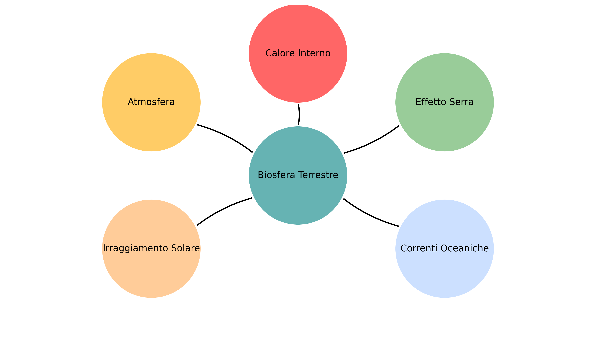

# Le Basi

## Cos'è il cambiamento climatico?

I [cambiamenti climatici](https://it.wikipedia.org/wiki/Cambiamento_climatico#cite_note-3) o mutamenti climatici sono le variazioni del clima sulla Terra. 

Ultimamente ci viene raccontato spesso che noi siamo la causa dei cambiamenti climatici. Non è sbagliato. Ma non è nemmeno giusto.

I mutamenti climatici sono propri nel nostro pianeta da sempre. Pensa alle Ere Glaciali. La terra è in costante ricerca dell'**equilibrio climatico**.

Il mantenimento dell'equilibrio nella biosfera terrestre è dovuto all'azione di questi cinque fattori:

1. Calore interno del pianeta
2. Irraggiamento solare che ci fornisce l'energia per l'effetto serra e gestisce i cambiamenti dell'attività solare.
3. Effetto delle correnti oceaniche ed evaporazione marina
4. Presenza dell'atmosfera che limita gli sbalzi di temperatura
5. Effetto serra naturale che amplifica l'effetto dell'irraggiamento.

Quindi, non sono questi fattori a causare dei cambiamenti climatici ma è la variazione di questi fattori che distrugge l'equilibrio terrestre.

***Qual è il nostro ruolo quindi?***

Beh, noi viviamo qui, e come parte della terra i nostri atteggiamenti vanno a influire sul suo equilibrio. Il nostro attuale stile di vita fa estremo uso dei cosiddetti combustibili fossili, immettendo nell'atmosfera grandi quantità di CO₂ e metano che aumentano l'azione dell'effetto serra generando quello che conosciamo come "surriscaldamento globale". La deforestazione e gli allevamenti intensivi poi, peggiorano ancora di più la situazione.

L'IPCC, composto da scienziati, ha affermato che a partire dalla metà del XX secolo le azioni dell'uomo sono state riconosciute come cause del cambiamento climatico sotto forma di alterazione dell'effetto serra. 

World Weather Attribution: ente che si occupa di scienza dell'attribuzione (cioè dimostrano i rapporti di causa-effetto tra l'aumento delle temperature e un fenomeno specifico) ha riconosciuto il 4 Settembre 2024 che la siccità estrema riscontrata nello stesso anno in Sicilia e Sardegna non sarebbe stata definibile "estrema" senza il cambiamento climatico dato dall'uomo. Le azioni dell'uomo hanno aumentato del 50% la probabilità che accadesse.

***Perché è così importante preoccuparcene?*** 

Perché ai livelli attuali il nostro pianeta è gravemente disequilibrato tanto da aver definito questa situazione: "crisi climatica".

Da queste premesse possiamo passare al concetto di impatto ambientale: 

## Cos'è l'impatto ambientale?

L’[impatto ambientale](https://it.wikipedia.org/wiki/Impatto_ambientale) è tutto ciò che le nostre azioni causano alla natura: i rifiuti che finiscono nei mari, la distruzione degli habitat naturali, l'inquinamento dell'aria e molto altro. 

Ogni scelta conta: quello che mangi, come ti sposti, cosa compri.

Scopri qual è il tuo impatto ambientale: [Fai il test!](https://www.footprintcalculator.org/sponsor/FR/it)

Per questo esistono strumenti come la Valutazione di Impatto Ambientale ([VIA](https://it.wikipedia.org/wiki/Valutazione_di_impatto_ambientale)), atto amministrativo previsto dalla legge che serve a valutare gli impatti ambientali di un'opera. 

> In Italia è normata C.Lgs. 152/2006

💡 Cosa puoi fare tu? Qui troverai alcuni semplici [consigli](4_stile_di_vita.md) per avere atteggiamenti consapevoli.

