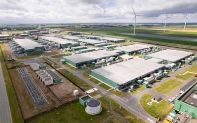

# Il Digitale

Durante gli ultimi anni abbiamo assistito ad un forte e repentino aumento dell'utilizzo delle tecnologie e del digitale. 

Non possiamo più vivere senza ma ciò non deve diventare una scusa per non utilizzarla in maniera consapevole. 

Purtroppo la nostra attività online è largamente inquinante!

I data center per mantenere archiviati i tuoi dati producono CO₂ 24 ore su 24 che finisce nell'atmosfera e peggiora il surriscaldamento globale. Inoltre richiedono ingenti quantità di acqua per essere raffreddati. 

I data center producono circa il 3,7% delle emissioni globali di CO₂ per mantenere sempre accessibili i nostri dati e sono destinati a produrre circa 2 miliardi e mezzo di tonnellate di CO₂ entro il 2030.

Come usi quei data center? Semplice, mandando e ricevendo email, ascoltando musica in streaming, guardando video e naviganto su Internet. Ogni tua azione online ha un costo ambientale.

Anche lo smaltimento dei rifiuti elettrici ed elettronici, i cosiddetti RAEE è estremamente importante.

Scopri di più leggendo questo [Paper](https://oajournals.fupress.net/index.php/smp/article/view/13236/12414) di Adele Bianco, ricercatrice.

## Ecco 10 semplici consigli per diventare un DigiGreen

1. 📩 Elimina le email vecchie o inutili
2. 📋 Disiscriviti dalle Newsletters 
3. 📂 Non inviare file troppo grandi per email. Salvali su cloud e invia semplicemente il link
4. 🎧 Scarica la musica che ascolti invece di ascoltarla in streaming
5. 🎞️ Non ascoltre la musica tramite video di YouTube, ma da applicazioni solo audio
6. ♻️ Porta i tuoi rifiuti tecnologici in un isola ecologica o al più vicino negozio di grandi dimensioni per smaltirli correttamente
7. 🖥️ Cerca di far durare i tuoi dispositivi elettronici per il maggior tempo possibile
8. 🌐 Quando non necessiti di un collegamento molto veloce riduci la tua connessione da 5G a 4G
9. 🔌 Se non stai usando il tuo dispositivo elettronico spegnilo, serve a lui e anche all'ambiente
10. ⚡ Informati sul tuo provider per sapere se utilizza metodi green di archiviazione dei dati
