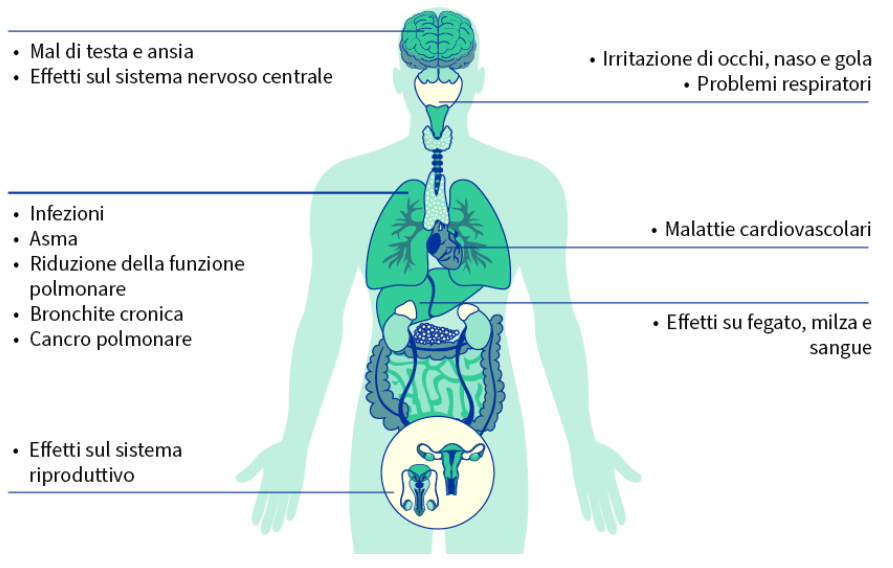
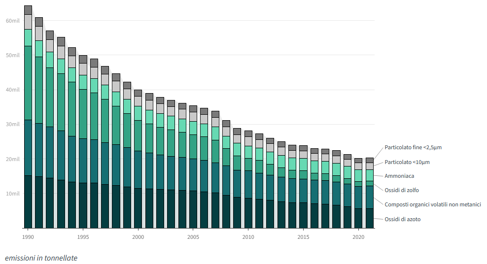
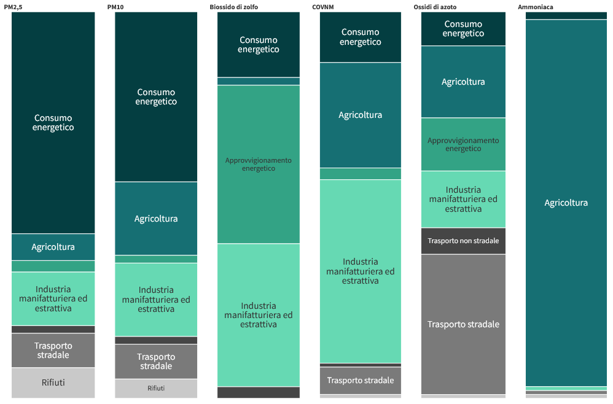
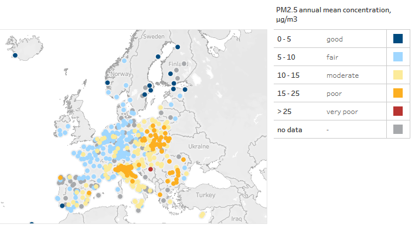

# Dati Statistici

Ecco alcuni grafici con alcuni dati sull'inquinamento ambientale. Per maggiori informazioni e per dati aggiornati si può consultare il sito ufficale citato nella fonte. 

Tra i principali inquinanti figurano:

    particolato
    ammoniaca
    metano
    ozono
    ossidi di azoto
    biossido di zolfo
    composti organici volatili non metanici

Ciascuno di essi è di per sé nocivo e alcuni possono persino reagire tra loro attraverso processi chimici e diventare particolato od ozono.

## Cause sul fisico

## Emissioni inquinanti del'ultimo anno

Fonte: [Agenzia europea dell'ambiente (AEA)](https://www.eea.europa.eu/en/analysis/maps-and-charts/contribution-to-eu-27-emissions?activeTab=570bee2d-1316-48cf-adde-4b640f92119b)

# Fonti di inquinanti atmosferici

Fonte: [Agenzia europea dell'ambiente (AEA)](https://ec.europa.eu/eurostat/databrowser/view/env_air_emis__custom_8249852/default/line?lang=en)

# Qualità dell'aria in Europa

Fonte: [Agenzia europea dell'ambiente (AEA)](https://www.eea.europa.eu/en/topics/in-depth/air-pollution/european-city-air-quality-viewer)

Dati raccolti e graficati dall'UE.